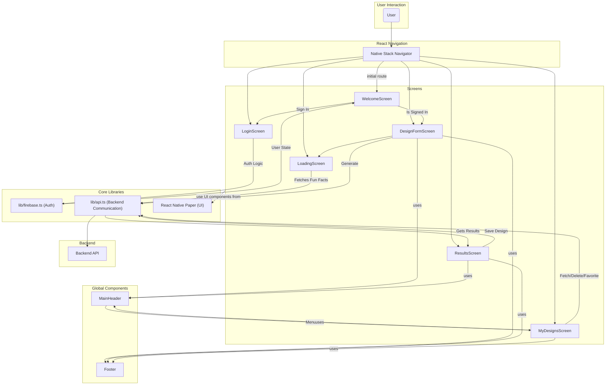

# Mobile App Architecture (Mermaid Syntax)

This file contains a Mermaid.js diagram illustrating the high-level architecture of the `newnails-fe` mobile application.

## Component & Navigation Flow

This diagram shows the relationship between screens, global components, core libraries, and the backend API.

