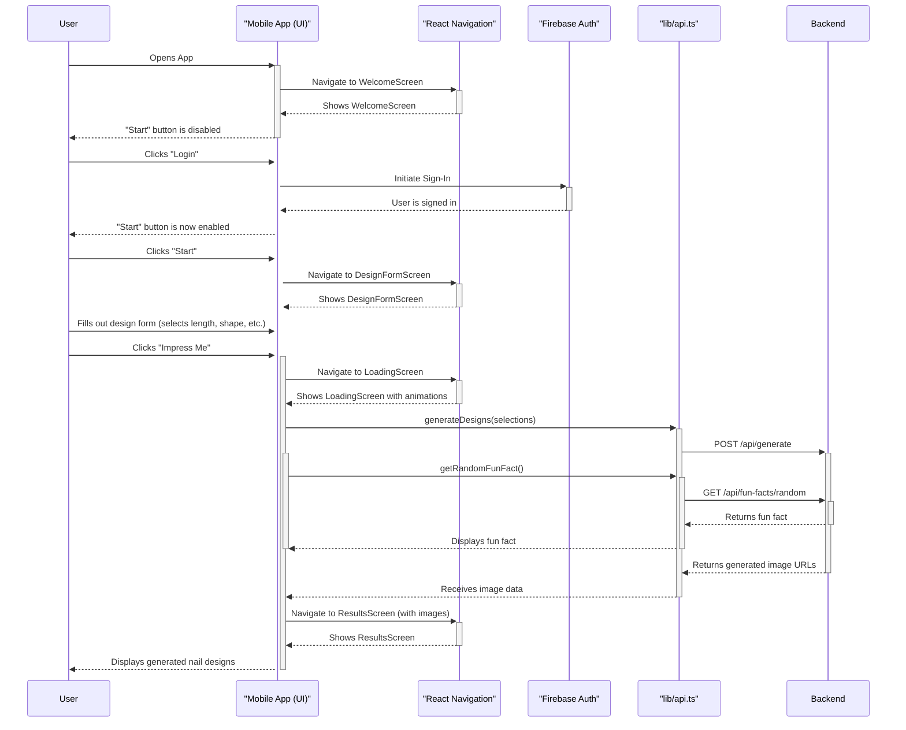

# Mobile App Sequence Diagram (Mermaid Syntax)

This file contains a Mermaid.js sequence diagram detailing the primary user flow for generating a nail design in the `newnails-fe` mobile app.

## User Flow: From Login to Viewing Results

